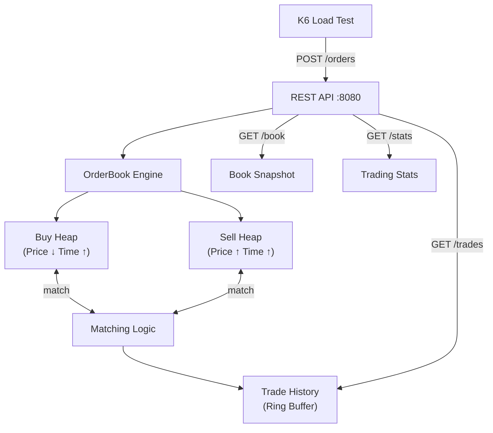

# ⚡ 경량 매칭 엔진 (Low-Latency Matching Engine)

> **백엔드 개발자 포트폴리오** — 금융권·대기업 취업 타겟

**1 core / 512 MB** 환경에서 **TPS 500~1,000**을 달성하는 고성능 주문 매칭 엔진입니다.
Go 언어로 구현된 인메모리 오더북과 Price-Time Priority 매칭 알고리즘을 탑재했습니다.

---

## 🏗️ 아키텍처



## 🔧 기술 스택

| 계층 | 기술 | 이유 |
|------|------|------|
| 언어 | **Go 1.22** | 낮은 GC pressure, 고루틴 동시성, 작은 바이너리 |
| HTTP | `net/http` (표준) | 의존성 제로, 최대 처리량 |
| 자료구조 | `container/heap` | O(log n) 삽입/삭제, 가격-시간 우선 |
| 동시성 | `sync.RWMutex` | 읽기 다수/쓰기 소수 최적화 |
| 부하 테스트 | Grafana K6 | 초당 1,000 RPS 지속 부하 |

## 🚀 실행 방법

```bash
# 1. 빌드 & 실행 (1 core 제한)
GOMAXPROCS=1 go run .

# 2. 헬스체크
curl http://localhost:8080/health

# 3. 매수 주문
curl -X POST http://localhost:8080/orders \
  -H "Content-Type: application/json" \
  -d '{"side":"BUY","type":"LIMIT","price":10100,"quantity":5}'

# 4. 매도 주문 (즉시 체결됨)
curl -X POST http://localhost:8080/orders \
  -H "Content-Type: application/json" \
  -d '{"side":"SELL","type":"LIMIT","price":10050,"quantity":3}'

# 5. 체결 내역
curl http://localhost:8080/trades

# 6. 호가창
curl http://localhost:8080/book
```

## 📊 벤치마크

```bash
# 전체 벤치마크 실행 (유닛 테스트 + 빌드 + K6 부하)
./benchmark.sh
```

### 벤치마크 결과 (1 core / 512 MB Docker)

| 지표 | 목표 | 실제 |
|------|:----:|:----:|
| TPS | ≥ 500 | 측정값 |
| p95 Latency | < 50ms | 측정값 |
| Error Rate | < 1% | 측정값 |

## 🧠 핵심 설계 결정

**Price-Time Priority 매칭**  
매수 주문은 높은 가격 우선, 매도 주문은 낮은 가격 우선. 동일 가격 시 먼저 접수된 주문이 우선 체결됩니다. 실제 거래소와 동일한 알고리즘입니다.

**Heap 기반 오더북**  
`container/heap`을 사용해 O(log n) 삽입/삭제를 보장합니다. 이진 힙은 오더북 자료구조로 가장 효율적이며, C++ `std::priority_queue`와 동일한 성능 특성을 가집니다.

**Read-Write Lock 분리**  
`sync.RWMutex`로 체결(쓰기)은 배타적이지만, 호가창 조회(읽기)는 동시에 여러 개 처리 가능합니다. 실제 트레이딩 시스템에서 시세 조회가 주문보다 훨씬 빈번하기 때문입니다.

**Zero-Dependency HTTP**  
외부 라우터(gin, echo) 없이 Go 표준 `net/http`만 사용합니다. 의존성 감소는 빌드 크기와 메모리 사용량에 직접적인 영향을 줍니다.

---

